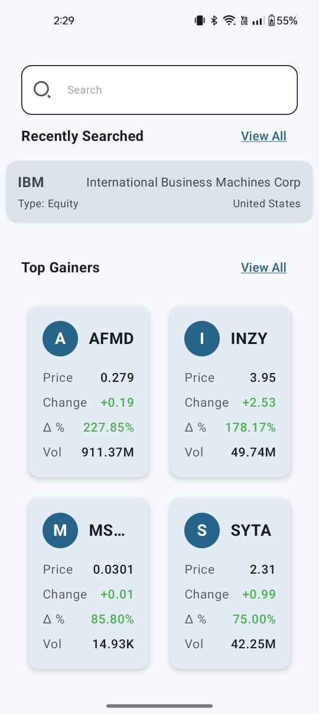
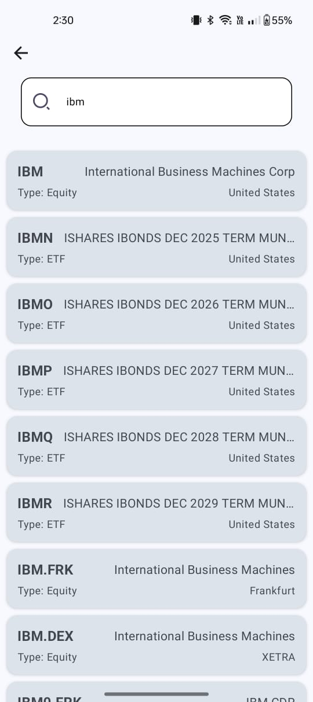
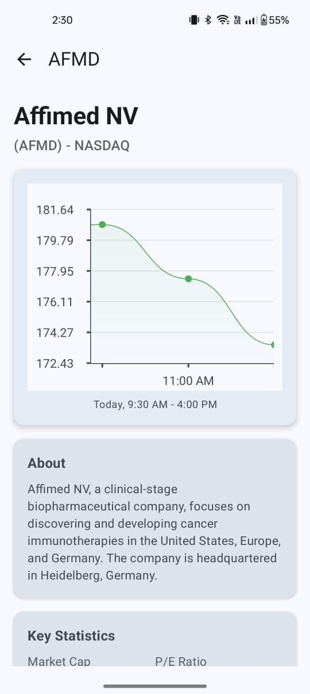
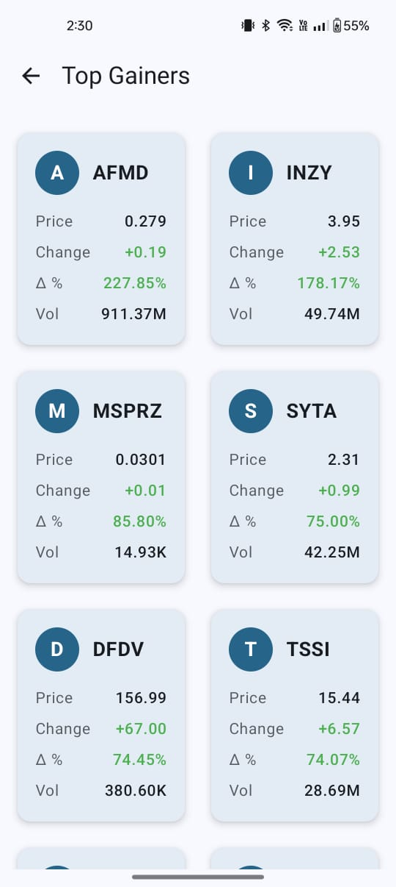
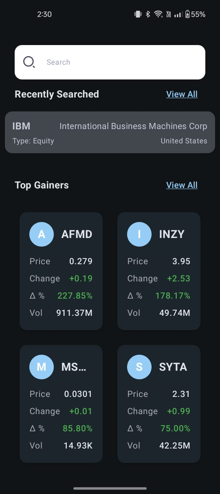
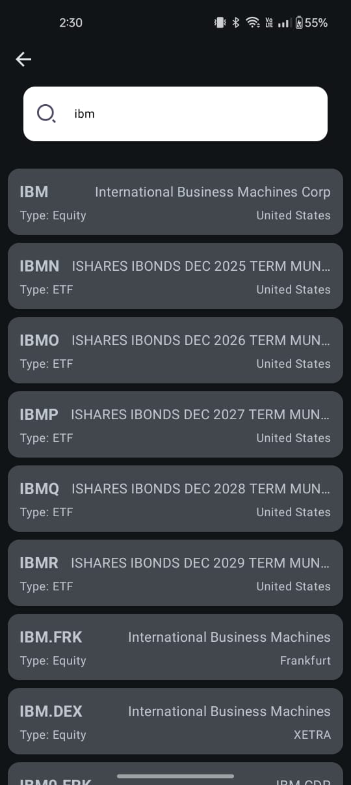
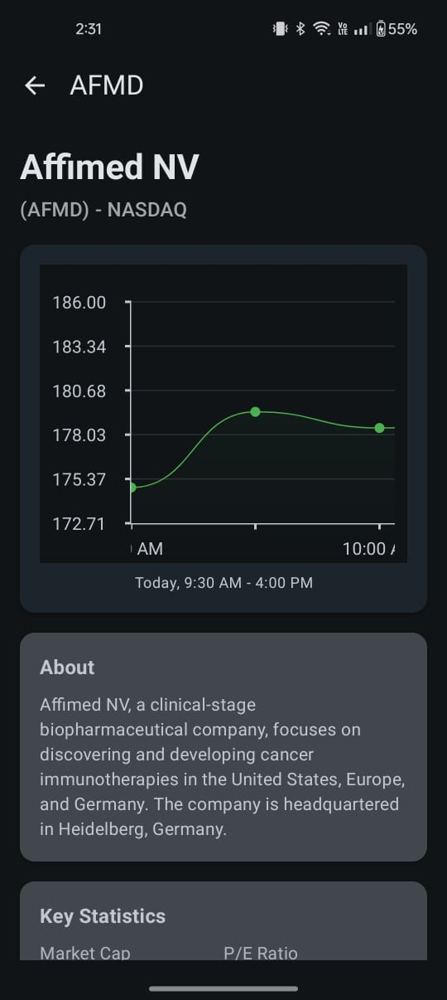
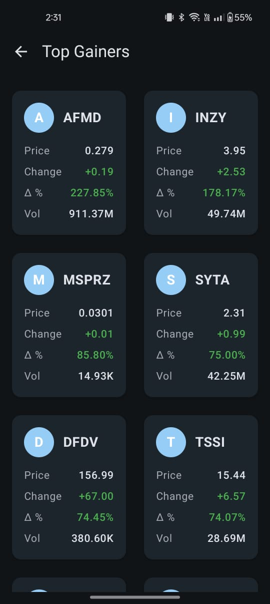

# 📈 StockTrack - A Stocks/ETFs Broking Android Application

**StockTrack** is a modern Android application developed in **Kotlin** that provides real-time information on stocks and ETFs. It integrates with the [Alpha Vantage API](https://www.alphavantage.co) to display top market movers, perform ticker searches, and present key company information. The app follows a robust **MVI architecture** and implements key features like caching, pagination, and dynamic light/dark themes.

---

## ✨ Features

### 🔍 Explore Screen
- Displays:
  - **Recently Searched** stocks/ETFs
  - **Top Gainers**
  - **Top Losers**
  - **Company Overview**
-  **Grid of cards** including:
  - Ticker Symbol
  - Company Name
  - Current Price
  - % Change

### 🔎 Search Functionality
- A **search screen** powered by the Alpha Vantage Ticker Search API.
- Searches are **cached** and displayed under the “Recently Searched” section.

### 📊 Product Screen
- Shows:
  - Stock/ETF fundamental information (Company Overview API)
  - A **line chart** of historical prices rendered using [`YCharts`](https://github.com/codeandtheory/YCharts)

### 📋 View All Screen
- Full list of Top Gainers and Top Losers and Recent Searches with pagination.

### 🌗 Light / Dark Mode
- The app supports **dynamic theming** – users can toggle between Light and Dark modes.

---

## 🏗 Tech Stack

- **Language:** Kotlin
- **Architecture:** MVI (Model-View-Intent)
- **Layers:** `data`, `domain`, `viewmodel`, `ui`
- **Dependency Injection:** Hilt
- **Network:** Retrofit
- **Charting Library:** [YCharts](https://github.com/codeandtheory/YCharts)
- **Caching with expiry:** RoomDB
- **State Management:** Loading, Error, Empty states handled across screens

---

## 🔐 API Integration

The application uses and caches the [Alpha Vantage API](https://www.alphavantage.co/documentation/) for:

- 📈 **Top Gainers/Losers:** via Alpha Intelligence endpoints
- 🏢 **Company Overview:** Basic fundamental data
- 🔍 **Ticker Search:** For stock/ETF symbol lookup

---

## 🖼️ Screenshots

### 🔆 Light Mode

| Home Screen                               | Search Screen                            | Details Screen                            | View All |
|-------------------------------------------|------------------------------------------|-------------------------------------------|----------|
|  |  |  |  |

### 🌙 Dark Mode

| Home Screen                              | Search Dropdown                         | Details Screen                           | View All |
|------------------------------------------|-----------------------------------------|------------------------------------------|----------|
|  |  |  |  |

